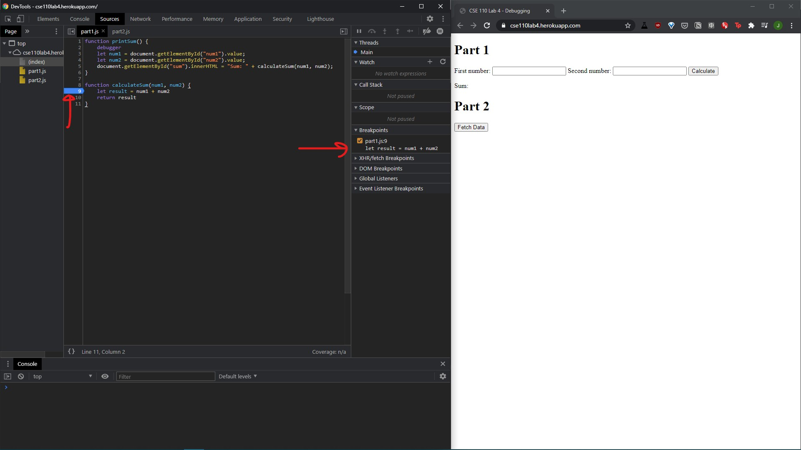
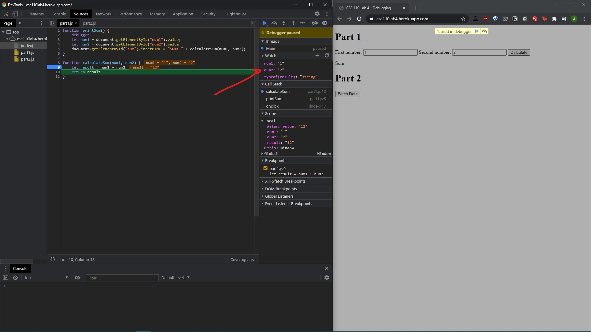
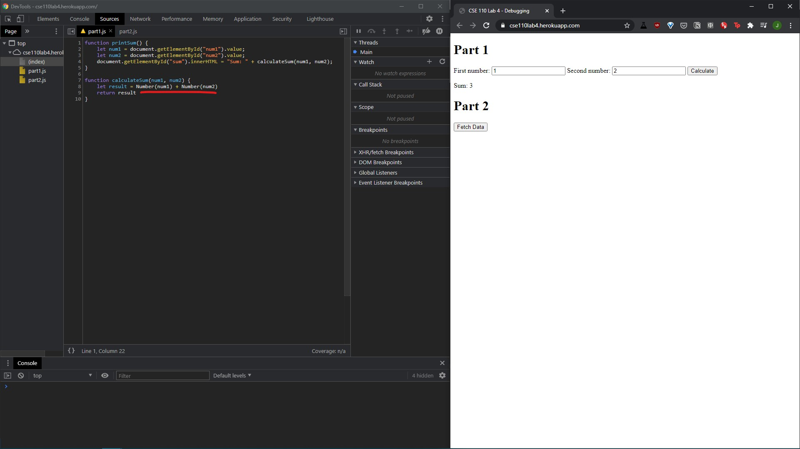

# DevTools - Debugging
Breakpoint at result in calculate sum:

Watch expressions for num1, num2, and the data type of result:

The bug was that num1 and num2 were read as strings so result was a string that consisted of concatenating num1 and num2 together.

I fixed it by converting num1 and num2 to Numbers:

# DevTools - Network Tab
1. citylots.json
2. part2.js
3. 11.7 MB
4. 20.79s

5. Mozilla/5.0 (Windows NT 10.0; Win64; x64) AppleWebKit/537.36 (KHTML, like Gecko) Chrome/88.0.4324.104 Safari/537.36
6. Apache
7. Tue, 26 Jan 2021 22:14:13 GMT
8. application/json

9. fetchData